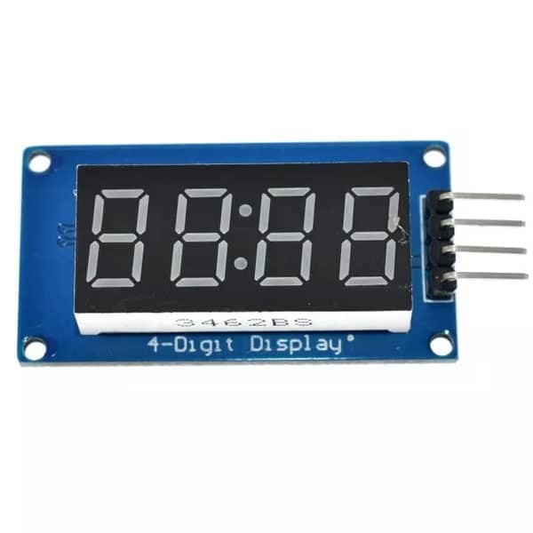
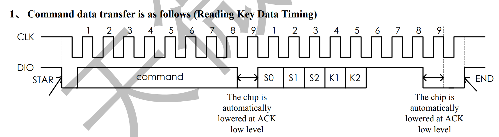
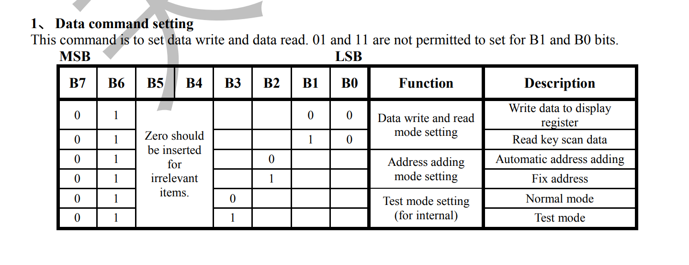
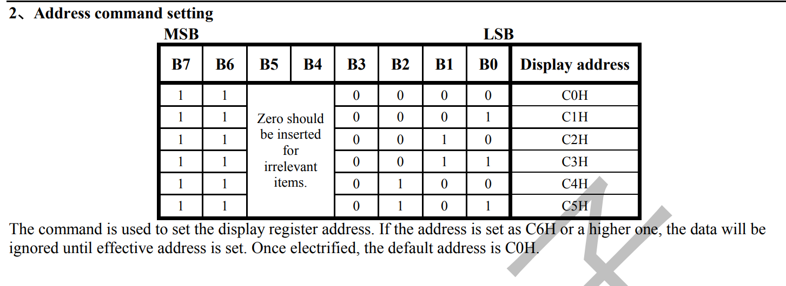
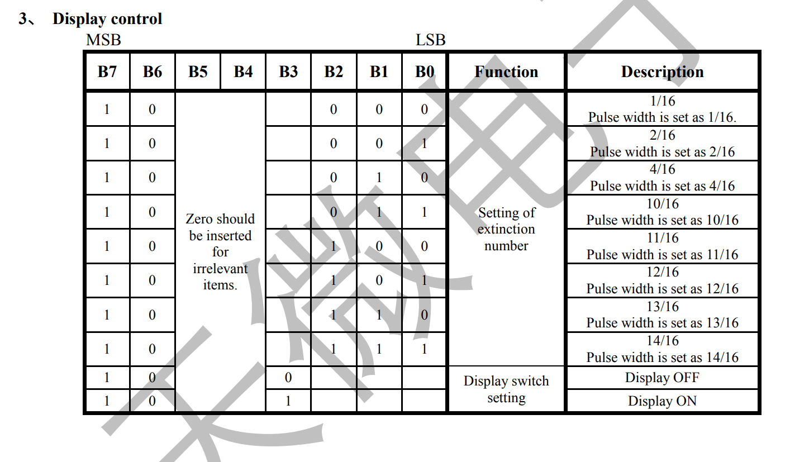
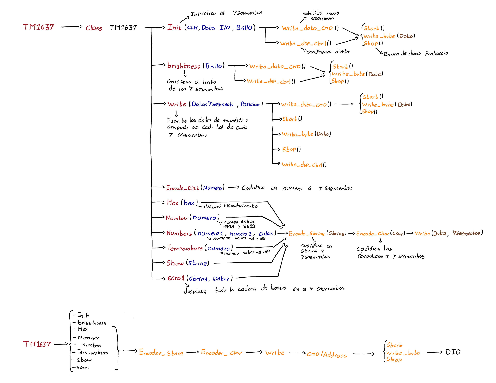

# Display 7segmentos - TM1637

El modulo Display 7 segmentos es un componente necesario en el controlador de aforo cuya funcion principal consiste en mostrar el numero estimado de personas en el interior del recinto, el componente que especificamente se escogio es un modulo de 7 segmentos el cual posee un integrado (**TM1637**) que reemplaza todas las conexiones individuales de LED en un protocolo de comunicacion propio el cual tiene gran parecido al ya existente I2C.

Debido a que es un protocolo de comunicacion diferente, no se puede realizar su implementacion a traves de I2C de modo que se creo su respectiva libreria que gestiona desde las comunicaciones basicas para enviar comandos (Protocolo de comunicacion), hasta 
los respectivos metodos que permiten mostrar diferentes tipos de caracteres en el display a traves de numeros y caracteres.

## **Protocolo de comunicacion**

El protocolo de comunicacion que se debe implementar para el integrado TM1637 Corresponde a un protocolo de comunicacion sincrono por lo cual en una linea se envian los datos y por la otra se sincronizan a traves de un reloj, este cuenta con sus respectivas señales de inicio y fin, ademas la informacion se manda en paquetes de bytes. a continuacion se muestra su respectivo diagrama de tiempos:

Como se puede observar su estado por defecto corresponde a ambas señales en un estado logico alto, de modo que para iniciar la transmision de datos el bus de datos baja su estado logico a 0 y seguidamente el clock empieza a enviar pulsos a una determinada frecuencia de modo que se envian varios paquetes de 1 byte con un pulso de confirmacion de por medio, una vez se termine la transmision de datos el reloj debe volver al estado logico alto seguido del bus de datos.

## **Comandos**

Una vez se tiene el protocolo de comunicacion por el cual se envian datos desde el microcontrolador al integrado TM1637 se ha de conocer llos respectivos comandos del integrado con los cuales se pueden: Enviar datos, configurar el 7 segmentos que recibe los datos y configurar su nivel de brillo. Las respectivas tablas de comandos se mostraran a continuacion.

## **Libreria**

Una vez conociendo el protocolo de comunicacion con el que se envia la informacion y los respectivos comandos con los que se puede operar el periferico, se procede a realizar su respectiva clase en micropython para controlarlo a traves de sencillos metodos. El primer metodo a realizar corresponde al protocolo de comunicacion el cual esta compuesto de 3 submetodos: **Start** (El cual actualiza ambas señales con su respectiva señal de inicio para el envio de datos), **Write_byte** (El cual se encarga de enviar bit a bit la informacion mientras actualiza el reloj cada 10 microsegundos) y **Stop** (El cual se encarga de realizar la señal de fin para el envio de datos), a traves de estos tres comandos se pueden enviar los datos bytes que se necesiten en el orden que se necesiten.

Una vez creado el protocolo de comunicacion se realiza el metodo de inicializacion de la clase (**Init**), el cual se encarga configura los respectivos pines del protocolo y configura un nivel de brillo en una variable, seguido a esto escribe los comandos respectivos para iniciar el modo de escritura de datos y configuracion del brillo del display. 

luego se define un metodo para cambiar el nivel de brillo del display cuando se requiera (**brightness**) actualizando el valor del mismo y configurando los 7 segmentos a traves de los mismos comandos utilizados en el metodo init. 

Una vez se tengan claros los comandos basicos para controlar el modulo 7 segmentos, se crea un metodo (**write**) el cual automatiza el proceso de asignacion de los valores respectivos a cada 7 segmentos a traves de un arreglo de 4 bytes, este metodo consiste en configurar el 7 segmentos en modo escritura de datos y seguido actualizar la direccion inicial (el 7 segmentos inicial) por una especificada (por defecto 0), luego se envian los bytes respectivos a cada 7 segmentos y por ultimo se vuelve a actualizar la configuracion de brillo del 7 segmentos finalizando la asignacion de valores del 7 segmentos respecitvamente, es necesario aclarar que la informacion de los bytes corresponde a la asignacion de encendido o apagado de cada led individual por lo cual para automatizar el proceso respectivamente se crean metodos adicionales que actuan como decodificadores para unicamente poner los valores tanto numericos como strings u otras posibles representaciones respecitivamente, la jerarquia de metodos de la clase se puede observar en el diagrama a continuacion:

## **Funcionamiento** 

En el siguiente enlace se muestra un video haciendo uso del montaje de desarrollo donde a traves de la libreria implementada **TM1637.py** se controlan los 7 segmentos con el codigo desarrollado **7segments-Ejemplo.py**.

*Poner Link del video