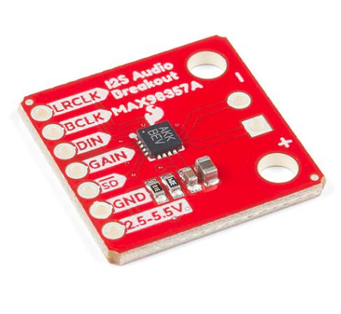

# Audio - MAX98357A

El decodificador y amplificador MAX98357A hace parte de los componentes cuya funcion son indicadores en el controlador de aforo, su funcion consiste en decodificar el audio almacenado en la tarjeta microSD y reproducirlo a traves de un speaker para dar indicaciones a los oyentes.

El protocolo de comunicacion que se implemento corresponde al I2S que viene ya integrado dentro de las librerias de micropython, aun asi debido a que se reproducen archivos de audio guardados en la tarjeta microSD se creo una libreria capaz de extraer dicha informacion y enviarla al buffer del protocolo cada vez que requiera datos.

## **Protocolo**

El protocolo de comunicacion I2S es un protocolo diseñado para enviar informacion sonora a traves de un bus de datos compartido a dos canales (Speaker R y L), por lo cual es una señal sincrona que cuenta con un pin extra que indica la direccion del canal a la cual va el dato respectivo tal y como se puede observar en el diagrama de tiempos a continuacion.

## **Libreria**

El modulo de audio se gestiono en micropython a traves de la implementacion de una clase que posea los metodos necesarios para reproducir, pausar, resumir la reproduccion de audio wav almacenado en la tarjeta microSD. Para lograr esto se debe tener en cuenta que la tarjeta microSD se gestiona a traves de la libreria **OS** de modo que se utilizaran las funciones de esta libreria para leer los archivos multimedia wav almacenados en la tarjeta microSD. El formato WAV (Waveform Audio Format) es un contenedor que guarda los datos de audio sin ninguna compresion como puede ser MP3, OGG, etc..., de modo que se puede leer directamente su informacion de la tarjeta microSD y transmitirla al bus I2S sin realizar un proceso de descompresion antes, el formato WAV posee una estructura de modo que sus primeros 44 bytes hacen referencia a las especificaciones y propiedades del formato tales como la frecuencia de muestreo, los canales, los bits por muestra, etc.. y luego siguen los datos de audio sin comprimir, su estructura es la que se puede observar a continuacion

Una vez aclarada la estructura del formato a utilizar se definen los metodos basicos de la clase **Wavplayer**, la primera corresponde al metodo de inicializacion (**Init**) el cual define el bus I2S a utilizar, los pines respectivos del protocolo, el tamaño asignado al buffer del protocolo y la ruta donde se encuentra el archivo a reproducir, ademas se crea un buffer donde se cargaran los datos de la memoria microSD. una vez declarados los valores necesarios para inicializar el protocolo se implementa el segundo metodo que corresponde a la reproduccion de archivos (**Play**), el metodo primero busca si existe un fichero con el nombre de audio especificado, luego revisa el estado de la clase si se encuentra actualmente reproduciendo un audio o en estado de pausa, en caso que se encuentre libre abre el respectivo fichero y ejecuta un metodo el cual se encarga de obtener la informacion de los primeros 44 bytes del formato y ajustar los parametros restantes del protocolo I2S tales como el numero de canales (estero o mono), la frecuencia de muestreo y el numero de bits por muestra (El metodo corresponde a **parse**), luego de obtener esa informacion restante se inicializa el protocolo I2S con los parametros configurados en init y la configuracion restante del archivo de audio de modo que se avanza en la lectura de los primeros 44 bytes del archivos, luego se declara un metodo que se ejecuta durante la interrupcion del protocolo I2S que corresponde a cuando el buffer esta vacio, este metodo corresponde a **I2S_callback** y se encarga de verificar el estado respectivo de la clase, en caso que se encuentre en reproduccion lee la informacion del fichero de audio desde la tarjeta microSD para luego transferirlos al buffer del protocolo I2S para que siga su reproduccion hasta que se vacie y genere otra interrupcion. Existe un caso especifico en la interrupcion el cual corresponde a cuando no se llena el buffer de lectura en la microSD lo cual implica que se encuentra al final del archivo WAV, por ende se copian los ultimos datos al buffer de audio y en caso que ya se hallan reproducido se cierra el archivo de audio, se desinicializa el protocolo I2S para que no genere mas interrupciones y se actualiza al estado STOP. los metodos **resume**, **stop** y **pause** solo actualizan el estado de la clase, mientras que el metodo **isplaying** retorna un booleano si el reproductor se encuentra en el estado PLAY. La jerarquia de comunicacion y los metodos mencionados anteriormente se pueden observar en el siguiente esquema.

## **Funcionamiento**

En el siguiente enlace se muestra un video haciendo uso del montaje de desarrollo donde a traves de las librerias implementadas **WAVPLAYER.py** y **SDCARD.py** se reproduce musica almacenada en la tarjeta microSD a traves de un parlante utilizando el codigo desarrollado **SpeakerSD-Ejemplo.py**

*Poner Link del video
