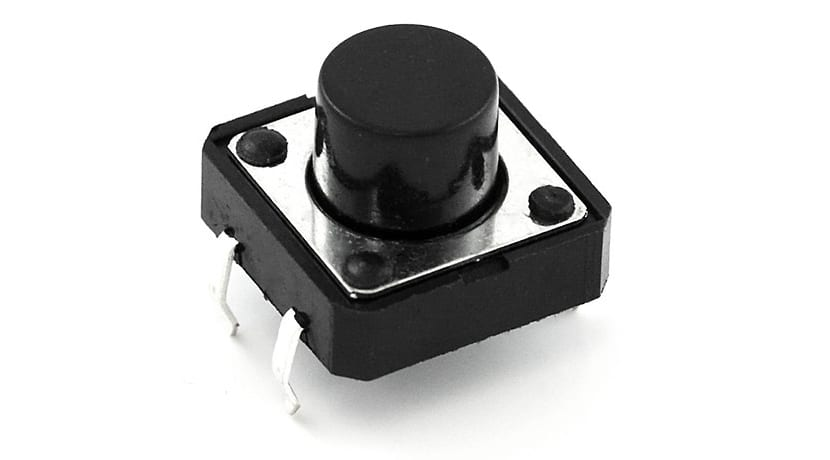

# Botones - Interrupciones

Los botones son componentes opcionales los cuales pueden otorgar funcionalidades basicas en caso que se requiera un control manual del dispositivo y no se pueda acceder al sistema de almacenamiento o modificar los parametros a traves del servidor WIFI, en el caso del controlador de aforo se implementan para corregir errores de medicion, incrementando/decrementando o reseteando la cantidad de personas estimadas en el recinto.

El control manual del dispositivo se planteo a traves de interrupciones de modo que cuando se detecte un flanco de subida/bajada (se configura mas adelante) se ejecute una funcion respectiva que se configurara en la programacion del codigo general, la declaracion de las interrupciones se implementa a traves del metodo **irq** de la libreria Pin correspondiente al modulo machine de micropython, los argumentos de la interrupcion corresponden a la accion que desencadena la interrupcion y la funcion que se debe ejecutar respectivamente, de modo que la estructura del metodo es: irq(handler,trigger).

## **Funcionamiento** 

En el siguiente enlace se muestra un video haciendo uso del montaje de desarrollo donde a traves codigo desarrollado **IrqButton-Ejemplo.py** se muestra el funcionamiento de las interrupciones externas en el microcontrolador.

*Poner Link del video