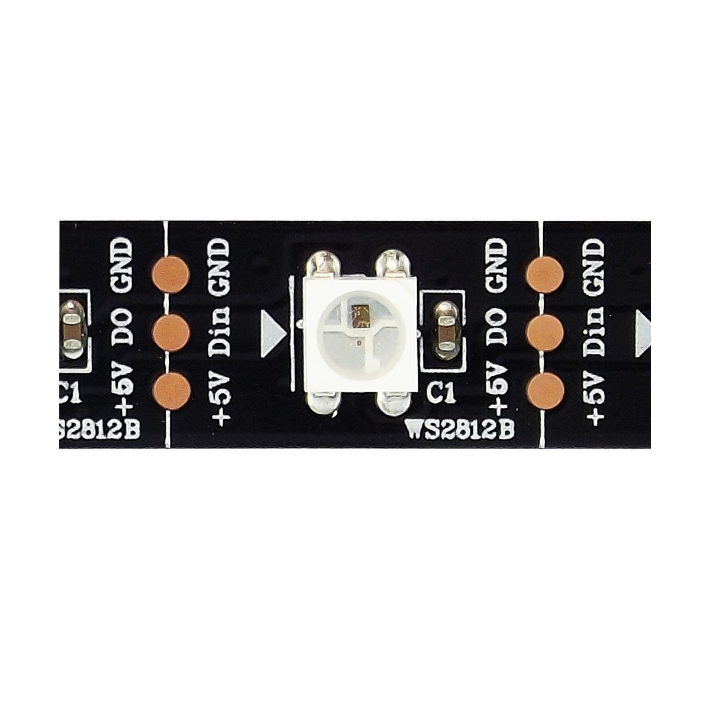

# LED RGB - WS2812B

El modulo de LED RGB hace parte de los componentes cuya funcion son indicadores en el controlador de aforo, su funcion consiste en cambiar de color dependiendo de que tanto aforo exista en el recinto siendo el color verde donde hay poco aforo, naranja donde hay medio aforo y rojo donde existe muy poco aforo.

El LED RGB WS2812B ya cuenta con una libreria integrada dentro de micropython por lo cual se hizo uso directamente de esa libreria, para su uso se declara la clase **NeoPixel** en una variable inicializandola con el pin de datos y el numero de pixeles a controlar, seguido a esto se seleccionan los valores de color RGB (8 por bits cada canal de color) y el numero del Led al cual se le cambien sus valores de color, por ejemplo np[0]=(255,255,255) y con este metodo se modifican directamente los colores del pixel seleccionado.

## **Protocolo**

El protocolo de comunicacion del LED WS2812B hace uso de un unico pin el cual envia la informacion a traves de un PWM con periodo fijo (1.25microsegundos) y un ciclo util variable, de modo que cuando el ciclo util es 25% el valor que interpreta es un 0, y cuando el ciclo util es 56% lo interpreta como un 1 como se puede observar en la siguiente imagen.

Teniendo en cuenta lo anteriormente mencionado, la informacion de color que se debe enviar es de 3bytes, lo cual implica que cada canal es de 8 bits(Rojo, Verde, Azul) y que para el control de multiples LEDS se envia primero la informacion del led mas lejano hasta el mas cercano de modo que para volver a posicionarse en el led mas lejano se debe enviar un pulso con ciclo util de 0%, el diagrama de tiempos para el control de multiples LEDs y la estructura de la informacion de color se puede observar a continuacion.

## **Funcionamiento**

En el siguiente enlace se muestra un video haciendo uso del montaje de desarrollo donde a traves codigo desarrollado **WS2812-Ejemplo.py** se muestra el funcionamiento del LED RGB en el microcontrolador.

*Poner Link del video

