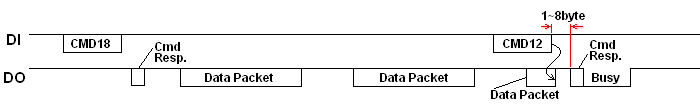
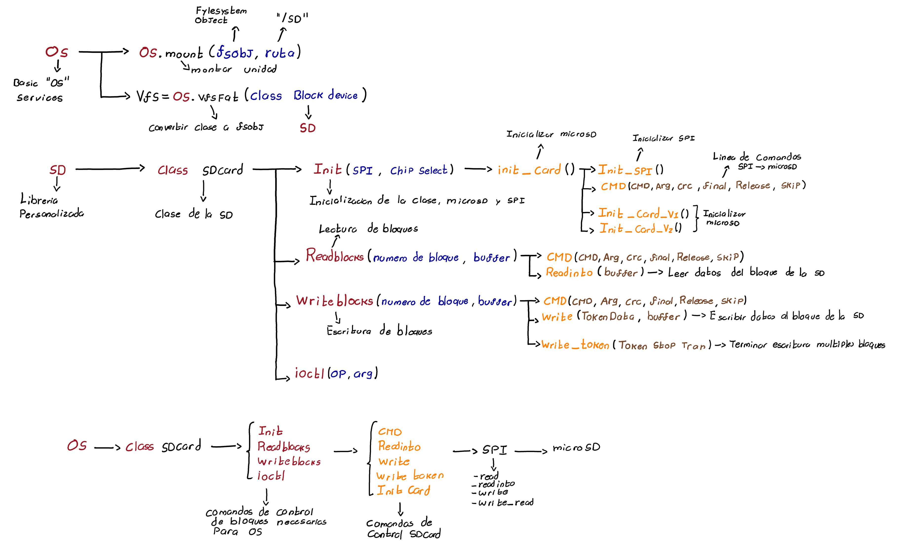

# Almacenamiento - MicroSD

El modulo de tarjeta MicroSD es fundamental para el almacenamiento externo del controlador de aforo, este funciona para guardar parametros de configuracion y datos del controlador de aforo en archivos de texto, ademas de poder almacenar archivos de audio en formato WAV que luego se leeran para poder reproducirlos en el sistema de audio.

La tarjeta microSD puede implementarse a traves del protocolo de comunicacion SPI para enviar y recibir datos del sistema de almacenamiento.

## **Protocolo**
El protocolo SPI es un protocolo que ya viene integrado dentro de las librerias de micropython por lo cual se hizo uso directo de las mismas, aun asi debido a que se configuraron pines que no correspondian al SPI en hardware de la ESP32 se utilizo el metodo **SOFTSPI** de la libreria para crear un controlador SPI a traves de software, el diagrama de tiempos y conexiones del protocolo SPI se puede observar a continuacion.

## **Comandos**

La tarjeta microSD se controla a traves de comandos que poseen una estructura de 6 bytes, para luego dar una respuesta de 1 byte (En la mayoria de comandos, dependiendo de que comando la respuesta puede ser mas grande), la estructura de los comandos es la siguiente:

| Byte1 | Byte1 | Byte1    | Byte2-5   | Byte6 | Byte6 |
|-------|-------|----------|-----------|-------|-------|
| 7     | 6     |   5-0    |   31-0    |   7   | 0     |
| 0     | 1     |  Comand  | Arguments | CRC   | 1     |

y la respuesta que se obtiene se estructura de la siguiente manera:

por lo cual el diagrama de tiempos de envio de comandos a traves del protocolo SPI tiene generalmente la siguiente estructura:

Como se puede observar los comandos que se envian a la tarjeta SD poseen una estructura donde se envia un comando de 1 byte seguido de un argumento de 4 bytes, por lo cual la lista de los comandos respectivos para controlar una tarjeta microSD y sus argumentos se muestra en la tabla a continuacion.

|                                                                          Command Index                                                                          |        Argument        | Response | Data |       Abbreviation       |                                         Description                                         |
|:---------------------------------------------------------------------------------------------------------------------------------------------------------------:|:----------------------:|:--------:|:----:|:------------------------:|:-------------------------------------------------------------------------------------------:|
| CMD0                                                                                                                                                            | None(0)                | R1       | No   | GO_IDLE_STATE            | Software reset.                                                                             |
| CMD1                                                                                                                                                            | None(0)                | R1       | No   | SEND_OP_COND             | Initiate initialization process.                                                            |
| ACMD41(*1)                                                                                                                                                      | *2                     | R1       | No   | APP_SEND_OP_COND         | For only SDC. Initiate initialization process.                                              |
| CMD8                                                                                                                                                            | *3                     | R7       | No   | SEND_IF_COND             | For only SDC V2. Check voltage range.                                                       |
| CMD9                                                                                                                                                            | None(0)                | R1       | Yes  | SEND_CSD                 | Read CSD register.                                                                          |
| CMD10                                                                                                                                                           | None(0)                | R1       | Yes  | SEND_CID                 | Read CID register.                                                                          |
| CMD12                                                                                                                                                           | None(0)                | R1b      | No   | STOP_TRANSMISSION        | Stop to read data.                                                                          |
| CMD16                                                                                                                                                           | Block length[31:0]     | R1       | No   | SET_BLOCKLEN             | Change R/W block size.                                                                      |
| CMD17                                                                                                                                                           | Address[31:0]          | R1       | Yes  | READ_SINGLE_BLOCK        | Read a block.                                                                               |
| CMD18                                                                                                                                                           | Address[31:0]          | R1       | Yes  | READ_MULTIPLE_BLOCK      | Read multiple blocks.                                                                       |
| CMD23                                                                                                                                                           | Number of blocks[15:0] | R1       | No   | SET_BLOCK_COUNT          | For only MMC. Define number of blocks to transfer with next multi-block read/write command. |
| ACMD23(*1)                                                                                                                                                      | Number of blocks[22:0] | R1       | No   | SET_WR_BLOCK_ERASE_COUNT | For only SDC. Define number of blocks to pre-erase with next multi-block write command.     |
| CMD24                                                                                                                                                           | Address[31:0]          | R1       | Yes  | WRITE_BLOCK              | Write a block.                                                                              |
| CMD25                                                                                                                                                           | Address[31:0]          | R1       | Yes  | WRITE_MULTIPLE_BLOCK     | Write multiple blocks.                                                                      |
| CMD55(*1)                                                                                                                                                       | None(0)                | R1       | No   | APP_CMD                  | Leading command of ACMD<n> command.                                                         |
| CMD58                                                                                                                                                           | None(0)                | R3       | No   | READ_OCR                 | Read OCR.                                                                                   |
| *1:ACMD<n> means a command sequense of CMD55-CMD<n>. *2: Rsv(0)[31], HCS[30], Rsv(0)[29:0] *3: Rsv(0)[31:12], Supply Voltage(1)[11:8], Check Pattern(0xAA)[7:0] |                        |          |      |                          |                                                                                             |

Una vez teniendo la estructura de comandos en cuenta se ha de saber que para los comandos de escritura y lectura de bloques se envian paquetes de datos de hasta 2048 bytes segun se haya configurado, la estructura del empaquetados de la lectura y escritura de bloques es la siguiente.

Por ende la estructura de tiempos de la lectura y escritura tanto de uno como de multiples bloques de datos de la tarjeta MicroSD es la siguiente:

### Single Block Read

### Multiple Block Read

### Single Block Write

### Multiple Block Write

## **Libreria**

Debido a que se implementaron pines diferentes en la tarjeta microSD que los del protocolo en Hardware es necesario no solo crear el protocolo SPI a traves de software sino crear un modulo que controle la tarjeta microSD, para esto se realizo un modulo pensando en controlar la tarjeta microSD a traves de la libreria de servicios basicos de "sistema operativo" **OS** integrada por ende se debe crear una clase que inicialice la tarjeta microSD y cuente con los metodos **readblocks**, **writeblocks** y **ioctl** necesarios para su utilizacion con la libreria **OS**, adicionalmente se deben crear los metodos necesarios para que las funciones mencionadas anteriormente puedan interactuar con la tarjeta microSD a traves del protocolo SPI. La jerarquia de comunicacion y metodos implementados para la comunicacion entre **OS** y la microSD se puede observar en el esquema a continacion:

Como se puede observar en el esquema de funciones, el protocolo SPI es el nivel de comunicacion mas bajo en la jerarquia teniendo una conexion directa con la tarjeta microSD, su implementacion en codigo respectivamente se hace utilizando el metodo **SOFTSPI** y  declarando como argumento los pines respectivos donde se realizara su comunicacion (MOSI, MISMO, CLK)(CS se gestiona independientemente) por lo cual una vez declarados los puertos se configura la cantidad de baudios con la que se comunicara el protocolo. una vez configurado el protocolo se hace uso de los metodos **spi.write**, **spi.read**, **spi.readinto** y **spi.write_readinto** para enviar y recibir datos incluso al mismo tiempo.

Una vez teniendo las funciones basicas de comunicacion del protocolo SPI, se necesita un metodo que permita enviar comandos a la tarjeta MicroSD para que pueda realizar diferentes funciones tanto de lectura como de escritura por lo que teniendo en cuenta la estructura de datos necesaria se declara un metodo que reciba los comandos y argumentos que se deseen enviar a traves de un buffer para luego utilizar el metodo spi.write y enviar dicha informacion a la tarjeta microSD de modo que luego se reciba una respuesta de un byte la cual sera retornada por el metodo, en caso de no recibir respuesta dentro de un tiempo determinado el metodo retorna -1.

Una vez determinada una funcion basica para el envio de comandos de la tarjeta microSD es necesario generar las funciones basicas para enviar y leer datos las cuales se reflejan en **readinto**, **write** y **write_token**. luego de definir las comunicaciones basicas es necesario inicializar la tarjeta microSD a traves de comandos que permitan iniciar la tarjeta microSD, obtener la version de la tarjeta, obtener el numero de sectores de la tarjeta y ajustar la longitud de los bloques a 512 bytes con el fin de que el sistema unicamente se encargue de escribir y recibir la informacion que necesita, por esto se declaran 3 funciones especificas de bloques necesarias para interactuar con los bloques de la tarjeta y almacenar/leer datos de la misma, estos bloques como se ha visto corresponden a **readblocks**, **writeblocks** y **ioctl** de modo que a traves de comandos de escritura/lecturas de uno o multiples bloques se envia/lee la informacion necesaria en la tarjeta microSD. 

con todos estos metodos definidos se puede controlar la tarjeta microSD a traves de la libreria **OS**, simplificando en modulos superiores el uso de comandos basicos de un sistema de archivos.

## **Funcionamiento**

Debido a que se penso la implementacion de la tarjeta SD principalmente para leer datos de audio y enviarlos a traves del protocolo I2S el video de funcionamiento esta compartido con el sistema de Audio.