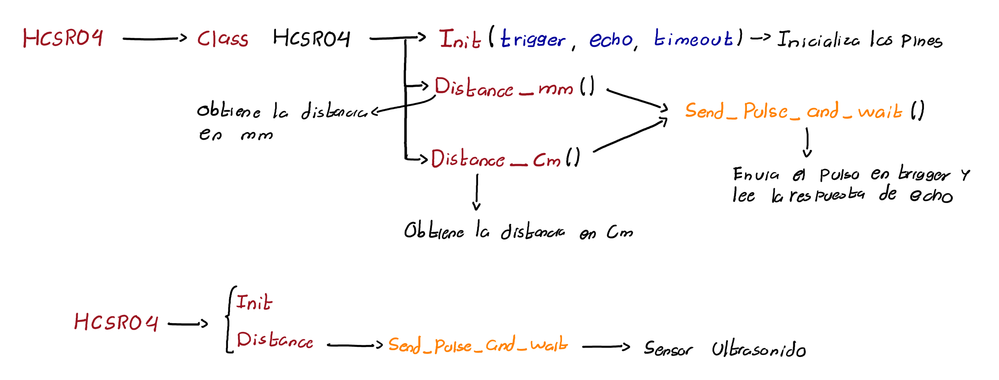

# Ultrasonido - HC-SR04

El modulo de ultrasonido HC-SR04 es la base del funcionamiento del controlador de aforo ya que otorga la capacidad saber si existe un objeto en movimiento que entre o salga del recinto y con esto poder obtener una estimacion en tiempo real del numero de personas que lo ocupan. 

## **Protocolo**

El funcionalmiento de este modulo se basa en un diagrama de tiempos donde a traves de un pulso desde el microcontrolador se le informa al ultrasonido que debe empezar su medicion y seguido a esto, el dispositivo genera un pulso con una duracion del tiempo que tardo el sonido en impactar con un objeto y devolverse al sensor , osea el doble de la distancia entre un objeto y el sensor.

## **Libreria**

La implementacion del modulo ultrasonido HC-SR04 dentro de micropython es sencilla de modo que su funcionamiento se resume principalmente en 3 metodos, el primero de ellos hace referencia a la inicializacion del ultrasonido (**Init**) de modo que unicamente configura los pines a implementar y configura un tiempo de espera en caso que no exista respuesta por parte del sensor para interrumpir el proceso, el segundo metodo corresponde a **Send_pulse_and_wait** y consiste en enviar un pulso de 10 microsegundos a traves del pin Trigger para indicarle al sensor que realice la respectiva medicion para luego haciendo uso de los contadores internos del microcontrolador registrar el tiempo en el cual el sensor mantiene activo el pin echo obteniendo el tiempo del pulso otorgado por el sensor, por ultimo el tercer metodo corresponde a **distance** consiste en almacenar la duracion del pulso devuelto por echo en el metodo anterior y realizar una conversion a las unidades relacionando la duracion del pulso con la velocidad del sonido y la distancia recorrida, la jerarquia de metodos se puede observar a continuacion.

## **Funcionamiento**

En el siguiente enlace se muestra un video haciendo uso del montaje de desarrollo donde a traves de la libreria implementada **HCSR04.py** se controlan los modulos ultrasonido con el codigo desarrollado **Ultrasonido-Ejemplo.py**.

*Poner Link del video