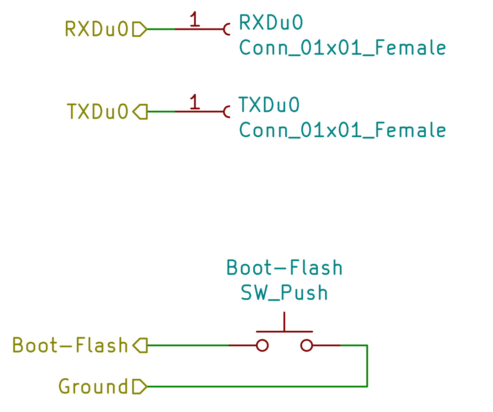

# Sistema Controlador de Aforo

Descripcion (Reemplazar por texto)

## Componentes
### Dispositivo - Base:
- ESP32-WROOM-32
- FT232RL o CP2102
### Dispositivo - Extras:

## Funcionalidades

### Funciones - Base:

### Funciones - Extras:

## Como funciona? 
El controlador de aforo se basa principalmente en el uso del chip **ESP32-WROOM** el cual ejecuta diferentes funciones en base a los requerimientos del proyecto, el esquema general de los modulos especificos que hacen posible su funcionamiento se puede ver en la imagen a continaucion.

### **ESP32-WROOM:**

Para el proyecto se decidio implementar como SoC el chip ESP-WROOM-32 dada su gran variedad de aplicaciones dentro del IoT ya que es un chip de bajo consumo ideal para alimentarlo a traves de baterias que posee conectividad bluetooth y wifi, su esquema de conexiones es el siguiente:

### **Alimentacion:**

### **Programacion:**

La programacion del dispositivo se realizara a traves de los pines U0TXD(41) y U0RXD(40) a traves de la interfaz UART, de modo que se requiere de un dispositivo con el cual se pueda realizar la conversion de Serial(USB) a Uart, en este caso se hara uso del modulo **FT232RL** o **CP2102** de manera externa debido a que no se requiere activamente en el funcionamiento del dispositivo, por ende unicamente se crearan sus conexiones hembra para cuando se desee unicamente programar el dispositivo.

Para poder implementar el proyecto dentro del microcontrolador se hara uso de la herramienta **ESPTOOL** la cual nos permite flashear(Reescribir) la memoria flash con la aplicacion que se ha programado para el chip, esto haciendo uso de los pines CLKOUT1 (23) para reescribir los datos de la memoria y ChipPU (9) para reiniciar el microcontrolador.

Por ende el bloque de programacion es muy sencillo, implementando unicamente 2 pines hembra donde iran Tx y Rx, ademas de un pulsador necesario para poder Flashear la memoria como se puede observar en el siguiente esquema:

Teniendo lo anterior en cuenta se necesita hablar del entorno de programacion, de modo que para este proyecto se hara uso de **ZephyrOS**