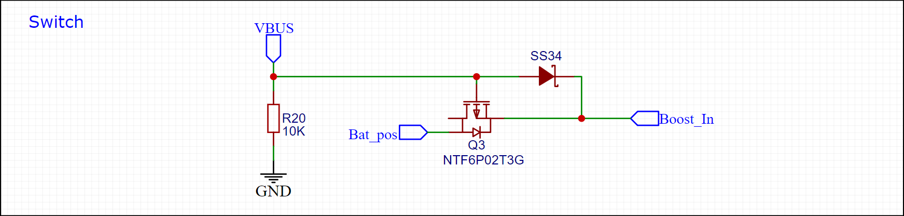
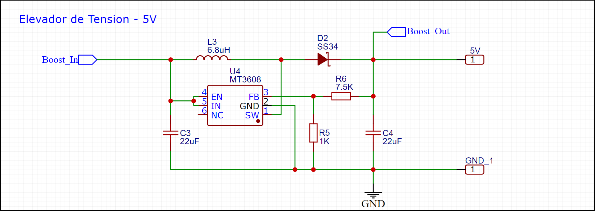
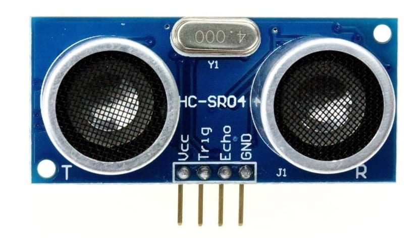

# **Sistema Controlador de Aforo**

## Autores
- Oscar Leonardo Riveros Perez
- Sergio Camilo Reina Cardenas

Este repositorio de codigo esta destinado al desarrollo del proyecto de la asignatura Sistemas Embebidos de modo que a continuacion se mostrara todas las consideraciones, guias de diseño, codigo y pruebas para realizar el sistema de control de aforo planteado a continuacion.

## En que consiste el Controlador de Aforo?

El dispositivo consiste en un sistema embebido capaz de detectar la entrada y salida de personas (incluso objetos) de modo que cuenta el aforo aproximado dentro del establecimiento, por lo cual a traves de esta informacion y datos previamente configurados como el area del recinto se pueda obtener cuantas personas ocupan un espacio en el recinto. Ubicando dicha cantidad de personas en 3 zonas (Aforo Libre - Aforo Concurrido - Aforo Lleno) se obtiene un control del estado de aforo del recinto de modo que dependiendo de la zona en la que se encuentre el recinto se emitiran distintas alertas que indican las acciones pertinentes a realizar para evitar el contagio de virus tales como el SARS-CoV-2 entre otros...

 la informacion mostrada y sensada se guarda en un respectivo positivo de almacenamiento para tener los ultimos registros actualizados y otorgar la posibilidad de actualizar el sistema sin necesidad de intervencion con el microcontrolador, ademas de que se implemento una interfaz con un servidor WEB la cual cumple la misma funcion teniendo la posibilidad de configurar el dispositivo y mostrando los datos de aforo en tiempo real.

## Componentes - Controlador de Aforo

El controlador de Aforo cuenta con los siguientes componentes para su funcionamiento:

- Dispositivos Base:
    - ESP32-WROOM-32 -> Microcontrolador
    - HC-SR04 -> Sensor de Distancia
    - Socket MicroSD -> Lector de tarjeta microSD
    - Botones -> Control manual
    - WS2812B -> Led Indicador de zonas
    - Display 7 segmentos (con Integrado TM1637) -> Contador de personas
    - Max98357A -> Amplificador y decodificador I2S
    - Speaker 4 Ohm 3W -> Indicador por Audio
    - Bateria 3.3v

  

- Alimentacion del dispositivo:
    - USB-C socket -> Puerto de carga
    - TP4056 -> Cargador de Baterias
    - DW01A -> Proteccion Bateria
    - NTF6P02T3G (PMOS) -> Puente de carga
    - MT3608 -> Elevador de tension
    - AMS1117-3v3 -> Regulador de tension 

  

- Programacion Externa:
    - FT232RL o CP2102

## Funcionalidades

El controlador de aforo ejecuta las siguientes funciones especificas necesarias para el correcto funcionamiento del sistema embebido:

- Leer y Almacener archivos en la memoria MicroSD
- Ejecutar interrupciones Externas
- Conectarse a una red de Wifi
- Enviar bytes de audio a traves del protocolo I2C
- Medir la distancia del entorno
- Cambiar el color de un LED RGB
- Enviar informacion a traves del protocolo especifico TM1637
- Enviar y recibir informacion de un servidor a traves de Wifi
- Carga de bateria a traves de alimentacion USB-C

  

# **Diseño de la PCB**

La PCB donde va montado el sistema completo del controlador de aforo se divide principalmente en 3 etapas, la primera consiste en la etapa de alimentacion basica para poder suministrar la potencia necesaria tanto a la ESP32 como a los dispositivos externos que posee el controlador de aforo necesarios para su correcto funcionamiento, la segunda etapa consta de el sistema basico que permite programar el microcontrolador para que pueda realizar las funciones requeridas por el usuario y por ultimo la tercera etapa consiste en la implementacion de todos los dispositivos externos que la ESP32 debera gestionar y coordinar correctamente para montar el dispositivo.

## **ESP32-WROOM:**

El microcontrolador que se planteo implementar para el desarrollo del controlador de aforo corresponde al SoC ESP32 debido a que posee integrado un chip capaz de gestionar y conectarse a redes WIFI de modo que dependiendo del establecimiento se pueden sincronizar mas o unos dispositivos a un servidor para su respectiva medicion estimada del flujo de personas en el recinto. 

Es necesario conocer el datasheet respectivo del dispositivo para conocer tanto sus ventajas como las limitaciones del dispositivo, por ende para diseño es importante conocer que el consumo maximo del Chip es de 260mA lo cual implica que es un chip de bajo consumo lo cual abre la posibilidad de poder ser alimentado a traves de baterias.

El esquema de conexiones respectivos del ESP32 se puede encontrar en la imagen a continuacion.

  

## **Etapa de Alimentacion**

Para la etapa de alimentacion se planteo que el dispositivo deberia ser lo suficientemente portable para poderse implementar en cualquier pared sin necesidad de depender de un tomacorriente, por lo cual se dispuso de la implementacion de una alimentacion hibrida entre una bateria de litio recagable a 3.7v y un puerto USB-C que proveaa la alimentacion necesaria tanto para el dispositivo como para cargar la bateria, por lo cual el primer modulo a plantear corresponde al modulo de carga y proteccion de la bateria.

### **Alimentacion - Modulo de Carga y proteccion de la bateria:**

Para el modulo de carga se ideo extraer la energia necesaria a traves de un conector Tipo-C que se conectase a una fuente de alimentacion, de modo que utilizando el integrado TP4056 con una resistencia de ajuste de valor $1.2k\Omega$ se obtenga una etapa de corriente maxima a 1A aproximadamente y luego una etapa de tension constante para terminar de cargar la bateria, el estado de carga se indicara a traves de 2 LEDs distintos para saber si se encuentra en el proceso de carga o esta terminada la carga de la bateria. Seguido a la etapa de carga se implemento directamente una etapa de proteccion utilizando el integrado DW01A-G el cual protege la bateria de Sobrecarga, Sobredescarga y Cortocircuitos utilizando el circuito de referencia que proporciona el fabricante, de modo que el esquema del Modulo de carga resultante se puede observar en la figura a continuacion:

### **Alimentacion - Puente de Carga**

Es importante tener en cuenta que cuando el circuito se encuentre cargando es necesario aislar la bateria para evitar afectar el proceso de carga de la misma llegando incluso a descargarla si la corriente requerida es mayor que la que se puede suministrar con el modulo de carga, por esto mismo se realizo un puente que cambia entre la conexion de la bateria y la fuente de alimentacion del USB-C a traves de un Mosfet y un diodo schottky lo cual permite que el circuito pueda cargar la bateria al mismo tiempo que seguir en funcionamiento, la unica implicacion a tener en cuenta es que la fuente de alimentacion debe ser capaz de suministrar la corriente de operacion del circuito y la corriente de carga de la bateria para poder funcionar correctamente, el esquema del puente realizado se puede observar en la figura a continuacion:

### **Alimentacion - Multiplicador de Tension:**

Una vez implementado el puente de carga que selecciona entre la bateria o la fuente de alimentacion directa se realizo una etapa de multiplicacion de tension a traves del integrado MT3608 el cual independientemente de la tension de entrada utiliza un sistema de realimentacion para ajustar su salida a 5v, esta etapa se realiza con el fin de poder suministrar la potencia necesaria a aquellos dispositivos que requieren una alimentacion de 5v tales como los modulos HC-SR04 (Ultrasonido) o el integrado MAX98357A (Audio), las resistencias implementadas para conseguir la relacion lineal de realimentacion que proporciona el fabricante corresponden a respectivamente corresponden a R1=$7.5k\Omega$ y R2=$1k\Omega$, su esquema respectivo se puede observar en la siguiente figura:

### **Alimentacion - Regulador de Tension**
Por ultimo se implemento una etapa de regulacion de tension para los dispositivos que lo requieren tales como el ESP32, la tarjeta Micro-SD y el display 7 segmentos respectivamente los cuales no requieren de mucha corriente, por lo cual se utilizo el integrado AMS1117-3.3 que viene previamente calibrado para regular la tension a 3.3v respectivamente facilitando enormemente su esquema de conexion el cual se puede observar en la siguiente figura:

 

## **Etapa de Programacion:**

La programacion del dispositivo se realiza a traves de los pines U0TXD (41) y U0RXD (40) del microcontrolador a traves de la interfaz UART, de modo que se requiere de un dispositivo externo con el cual se pueda realizar la conversion de Serial(USB) a Uart para su programacion respectiva utilizando un computador, en este caso se hara uso del modulo **FT232RL** o **CP2102** de manera externa debido a que la etapa de programacion unicamente se implementa para configurar el microcontrolador.

Para poder implementar el proyecto dentro del microcontrolador se hara uso de la herramienta **ESPTOOL** la cual nos permite flashear(Reescribir) la memoria flash con la aplicacion que se ha programado para el chip, esto haciendo uso de los pines CLKOUT1 (23) para reescribir los datos de la memoria y ChipPU (9) para reiniciar el microcontrolador.

Arbitrariamente se implemento un led Azul haciendo uso del pin GPIO2 de modo que este indique si el dispositivo esta en funcionamiento.

Teniendo en cuenta lo anterior se realizaron las conexiones correspondientes al bloque de la programacion, en el caso de los pines U0TXD (41) y U0RXD (40) se realizaron conexiones basicas con pines Hembra dejando las conexiones abiertas para cuando se requiera programar el dispositivo, para el pin CLKOUT1 (23) se conecto el pin directamente a un boton conectado a tierra debido a que el fabricante especifica que internamente existe una resistencia de Pull-Down por lo cual, al pulsar el boton se entre al Bootloader cuando se requiera, luego para el pin ChipPU (9) se realizo una conexion de resistencia Pull-Up con la fuente y tierra usando una resistencia de 10k de modo que cuando se realize una pulsacion se reinicie el dispositivo, por ultimo el LED se conecto al pin GPIO2 (22) y a una resistencia de 180 $\Omega$ que va a tierra de modo que se tiene un consumo promedio de 3.3mA, el esquema resultante se puede observar en la siguiente figura:

  

## **Etapa de Dispositivos Externos**

### **Sistema de Deteccion - Sensor HC-SR04:**

Para el sistema de deteccion se buscaron multiples alternativas que hiciesen posible medir la distancia de un objeto respecto al sensor de modo que finalmente se decidio utilizar el sensor HC-SR04 (Sensor de distancias por Ultrasonido), el sensor HC-SR04 consta de 4 pines siendo estos: Alimentacion(5v), Tierra(GND), Trigger(TTL)-Input y Echo(TTL)-Output de modo que aunque la alimentacion del sensor sea de 5v, la salida de Echo se entrega respecto al nivel TTL de Trigger, por ende se puede implementar directamente sin utilizar conversores logicos 5v-3.3v en el ESP32, adicionalmente se especifica que el sensor consume aproximadamente 15mA de corriente.

Para lograr el sistema de deteccion se penso en implementar hasta 4 sensores ultrasonido de modo que se pudieran implementar multiples configuraciones como se especificara en la programacion respectiva, la implementacion de 4 sensores maximo tiene como consecuencia un consumo maximo de 60mA y el uso de 8 pines logicos en el microcontrolador los cuales estan asignados de la siguiente manera (Trigger, Echo): Ultrasonido 1 (GPIO26, GPIO36), Ultrasonido 2 (GPIO25, GPIO39), Ultrasonido 3 (GPIO33, GPIO34), Ultrasonido 4 (GPIO32, GPIO35), esta de mas aclarar que estos pines estan conectados directamente a puertos hembra que saldran del empaquetado 3D debido a que el ultrasonido se debe instalar en alguna superficie externa a la placa, el esquema resultante de las conexiones se  observar en la siguiente figura:

  

### **Control Manual - Botones:**

El sistema de control manual unicamente se basa en la interaccion fisica directa entre algun operario y el mismo sistema, de modo que se implementaron 3 sistemas de resistencias Pull-Up con la fuente y tierra usando resistencias de 10k, ademas de que las conexiones de los botones respectivos se dejo abierta por dos pines hembra debido a que se realizara un cableado para colocar estos botones en la carcasa de la caja, los pines utilizados en el microcontrolador son: GPIO27, GPIO14 y GPIO12, el esquema resultante del control manual se puede observar en la figura a continuacion:

  

### **Sistema de Indicadores:**

En este apartado se implementaron distintos metodos para tener una interaccion mas directa desde el sistema con el usuario, por lo cual a continuacion se describiran los multiples sistemas implementados para dar indicaciones a los usuarios.

#### **Sistema de Indicadores - Audio:**

En el caso del Sistema Indicador de Audio se vieron diferentes formas de implementar un speaker, de modo que se opto por implementar el integrado MAX98357A el cual consiste en un decodificador del protocolo I2S seguido de un DAC interno con una etapa de amplificacion clase D. Para el proposito del proyecto aunque el protocolo soportase usar dos canales diferentes, unicamente se implemento un canal (Izquierdo) lo cual implica que el pin SD_MODE del integrado esta conectado directamente a 3.3v, adicionalmente se escogio de manera arbitraria obtener una amplificacion de 15dB por lo cual como se especifica en su datasheet se conecto el pin de ganancia a tierra mediante una resistencia de 100k $\Omega$, otras consideraciones que se realizaron es que las salidas del Speaker (R+ y R-) se conectaron en serie con una impedancia dinamica de altas frecuencias junto a condensadores para filtrar el ruido de alta frecuencia que se puede encontrar el altavoz. Con lo anterior en cuenta se utilizaron 3 pines del microcontrolador destinados al protocolo I2S siendo estos GPIO21 (Serial Clock), GPIO22 (LRCLK) y GPIO19 (Data In), es importante tener en cuenta que el integrado esta diseñado para altavoces entre 4 $\Omega$ y 8 $\Omega$ ademas de tener una entrada de alimentacion entre 2.5v y 5v, lo cual implica que la potencia maxima de la amplificacion es de 3.2w y por ende entrega una corriente maxima de 1.25A, el esquema resultante se puede ver en la figura a continuacion:

#### **Sistema de Indicadores - LEDs:**
Para el sistema de Indicador visual de LEDs se planteo la utilizacion de los LEDs 
WS2812B que funcionan a traves de señales digitales y permiten el acople de multiples LEDs utilizando la misma linea de datos de modo que se utilizo el pin GPIO23 del microcontrolador para su respectivo control, originalmente se plantea implementar un unico LED RGB pero no se descarta la opcion de implementar LEDs adicionales, de modo que se crea una segunda conexion para realizar el acople con uno o mas LEDs adicionales ademas se debe tener en cuenta que el consumo maximo de cada LED es de 50mA (16mA por cada subLED), debido a que se planea montar los LEDs en la carcasa del dispositivo se realizaron conexiones hembra para todos los pines tanto del primer LED como el acople con los LEDs adicionales para cablearlos afuera de la placa, el esquema respectivo se puede observar en la siguiente figura:

  

### **Sistema de Almacenamiento - MicroSD:**

En el sistema de almacenamiento se opto por la implementacion de una tarjeta Micro-SD a traves del protocolo de comunicacion SPI, de modo que se utilizan 4 pines del microcontrolador siento estos GPIO17 (SD_Clock), GPIO5 (SD_Input), GPIO16 (SD_Output) y GPIO18 (Chip Select), la tarjeta MicroSD se conecto a traves de su socket respectivo de modo que se ha de tener en cuenta que esta consume aproximadamente 50mA cuando opera a traves del protocolo SPI, adicionalmente se conecto un LED azul en el Socket de la tarjeta con una resistencia de 180 $\Omega$, el cual funciona como indicador de cuando esta conectada la tarjeta o desconectada de modo que genera un consumo adicional de 3.3mA, el diagrama de conexiones del sistema de almacenamiento se puede observar a continuacion:

  

### **Puertos de Expansion - ${I^2C}$ y GPIO:** 

Debido a que unicamente sobran 3 pines del microcontrolador se decidio conectar 2 de ellos a traves del protocolo de comunicacion ${I^2C}$ de modo que se conectaron en un sistema resistor de Pull-Up con una resistencia de 5k $\Omega$ a la fuente y se dejaron sus conexiones libres a pines hembra para poder conectar dispositivos adicionales con este sistema, los pines implementados para el $I^2C$ Corresponden a GPIO15 (SCL) y GPIO13 (SDA). En el caso del ultimo pin libre el cual es GPIO4 se creo una conexion a un pin hembra de modo que en caso que se requiera por alguna funcionalidad adicional se pueda utilizar libremente en la placa, el esquema correspondiente de los puertos de expansion se pueden observar en la siguiente figura:

  

### **Esquema General - ESP32:** 

El esquema general de las conexiones anteriormente mencionadas al microcontrolador se puede observar en la figura a continuacion:

 

## **PCB y Modelo-3D**

Una vez descritas todas las conexiones planteadas y las funcionalidades de la placa se realizo el respectivo ruteo de las pistas en la PCB teniendo en cuenta las corrientes maximas que se deben soportar sobre cada pista cuando el dispositivo bajo maxima operacion y cargando la bateria respectivamente (Se estima que maximo se consuman hasta 2.6A en casos extremos por la pista VBus), adicionalmente se tomo el tiempo necesario para realizar todas las pistas sobre la capa superior de la placa dando como resultado los esquemas que se observaran a continuacion:

Teniendo el diseño completo de la PCB del controlador de aforo se utilizaron distintos servicios para fabricar y soldar el sistema completo obteniendose la placa que se puede observar en las siguientes imagenes:

**Insertar Diseño de caja 3D, impresion de la caja

# **Programacion del Dispositivo**

Una vez realizado el diseño y fabricacion de la PCB donde se  integran los componentes necesarios para el correcto funcionamiento tanto del microcontrolador como los dispositivos externos, se realiza la respectiva programacion del microcontrolador a traves de micropython. El desarrollo del codigo necesario para controlar los perisfericos individualmente se presenta a continuacion:

- [Display 7 Segmentos - TM1637](/Perifericos/7segmentos.md)

- [LED RGB - WS2812B](/Perifericos/LEDRGB.md)

- [Botones - Interrupciones](/Perifericos/Botones.md)

- [Ultrasonido - HC-SR04](/Perifericos/Ultrasonido.md)

- [Almacenamiento - MicroSD](/Perifericos/MicroSD.md)

- [Audio - MAX98357A](/Perifericos/Audio.md)

Una vez realizado el codigo necesario para controlar los diferentes perifericos para el controlador de aforo, se implemento el codigo principal del sistema el cual se puede resumir en el siguiente diagrama donde se muestra la logica del algoritmo de ejecucion. 

De modo que teniendo la rutina de funcionamiento del sistema controlador de aforo se pone a prueba su funcionamiento tal y como se puede observar en los siguientes videos

[Video Prueba Codigo Principal](https://drive.google.com/file/d/1DpC-rx6eNb7NdOsbPi9TDKSZAz35STaH/view?usp=sharing "Video Prueba Codigo Principal")

[Video Prueba Codigo Principal - Botones](https://drive.google.com/file/d/1Xm1BT4d_Bo_UqYZqokCm6PzdpIdTOp7b/view?usp=sharing "Video Prueba Codigo Principal - Botones")

 

## **Notas de Diseño**

Algo que se debe tener muy en cuenta a la hora de replicar el controlador de aforo para mejorar el diseño corresponde a las resistencias Pull-Up implementadas en los botones, esto debido a que no se observo que en el datasheet del microcontrolador implementado se especifica que el Pin 12 debe estar en configuracion Pull-Down para el correcto funcionamiento de la placa, en este caso debido a que se implemento una resistencia Pull-Up la placa generaba error al intentar ser programada por lo cual se tuvo que quitar el resistor correspondiente al pin GPIO12 para deshabilitar el respectivo Pull-UP, la tabla que especifica si un pin debe estar en configuracion Pull-Up o Pull-Down para su correcto funcionamiento al reiniciar es la siguiente:

